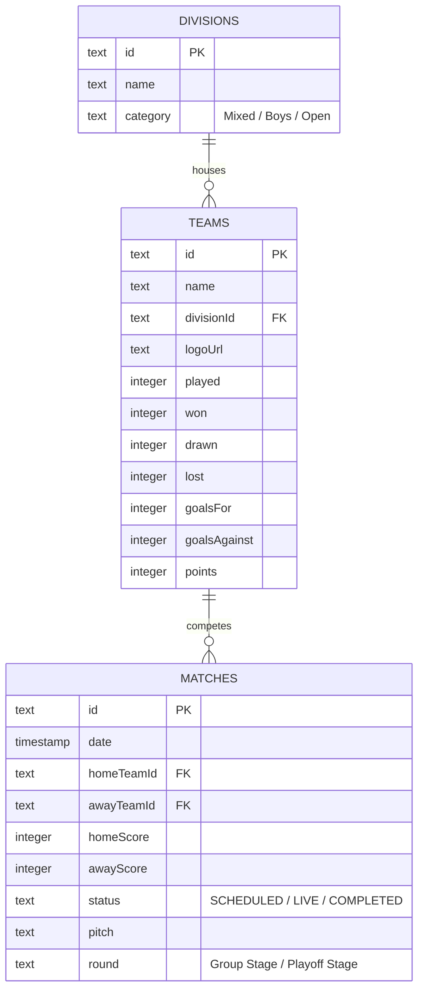

# COPA Cebu 2026 Design Document

Welcome to the **COPA Cebu 2026** codebase! This document provides an architectural layout and design system manual for the sports tournament platform. It aligns developers and visual generation tools (such as Google Stitch) to maintain a cohesive, high-performance, and premium developer environment, completely avoiding unstructured or "vibecoded" setups.

---

## 🌟 1. Project Vision & Purpose

**COPA Cebu 2026** is a premium soccer tournament portal hosted at the Dynamic Herb Sports Complex in Talisay City, Cebu. The portal is designed to provide:
1. **Live Updates:** Live game trackers, scoreboards, and stage filters.
2. **Rankings:** Dynamic league standings based on wins, draws, goals, and points.
3. **Official Info:** Rules, regulations, roster guidelines, and venue schedules.
4. **Admin Console:** A secure interface for officials to update scores and manage fixtures in real-time.

---

## 💻 2. Tech Stack

The application leverages a modern React and serverless database stack:

- **Framework:** Next.js 16.2.x (with React 19 and App Router setup)
- **Styling:** Tailwind CSS v4 (with PostCSS configuration)
- **Database ORM:** Drizzle ORM with Neon PostgreSQL serverless adapter
- **Icons:** Lucide React icons
- **State & Logic:** Server components by default, with client-side interactive widgets (like search, paginated schedule views, and countdowns).

---

## 🎨 3. Design System & Style Guide

All visual components must follow the brand rules defined in [globals.css](file:///c:/Users/clarkyu/copa/src/app/globals.css):

### Color Tokens
- **Copa Blue (`#007cff`):** Core branding color, CTAs, interactive buttons.
- **Cebu Green (`#20c96c`):** Live indicators, winning highlights, success elements.
- **Year Purple (`#a845f5`):** Secondary accent, division headers, tournament badges.
- **Background (`#f8fafc`):** Cool light-gray slate background.
- **Foreground (`#0f172a`):** Deep slate-blue for body text and headers.

### Typography
- **Sans Serif Font:** `Plus Jakarta Sans` (`var(--font-sans)`) used for layout descriptions, grids, stats, tables, and buttons.
- **Display Font:** `Space Grotesk` (`var(--font-display)`) styled as `uppercase font-black` for headlines, standings numbers, team headers, and scoreboard digits.

### Structural UI Classes
- `.glass-panel`: Translucent white card (`rgba(255, 255, 255, 0.75)`) with `backdrop-filter: blur(16px)` and a subtle border outline.
- `.hover-card`: Interactive grid cards featuring a smooth `translateY` animation and a hidden gradient border (Copa Blue ➔ Year Purple ➔ Cebu Green) that lights up on mouse hover.
- `.mesh-bg`: Ambient background mesh containing faded radial color blots.
- `.grid-overlay`: Dotted overlay providing depth under main hero items.

---

## 🗃️ 4. Data Models & Database Schema

The database is built with Drizzle ORM as defined in [schema.ts](file:///c:/Users/clarkyu/copa/src/db/schema.ts):



### Schemas
1. **Divisions:** Category grouping (e.g. `Mixed P-7`, `Boys P-15`, `Men's Open`).
2. **Teams:** Registration tracker counting stats (wins, losses, draws, GD, points) to dynamically update the standings.
3. **Matches:** Match scoreboard logging start times, date, pitches, status, and scores.

---

## 🗺️ 5. Project Directory & Route Structure

```text
copa/
├── src/
│   ├── app/                    # Next.js App Router Pages
│   │   ├── admin/              # Real-time score controller and database manager
│   │   ├── information/        # General news, venue, contacts
│   │   ├── rewards-prizes/     # Prizes breakdown structure
│   │   ├── rules/              # Roster eligibility and match guidelines
│   │   ├── schedule/           # Tournament matches with filter sliders
│   │   ├── standings/          # Group tables, rankings, points
│   │   ├── globals.css         # Tailwind directives, keyframes, custom utility classes
│   │   ├── layout.tsx          # Root Layout wrapping Navbar and Footer
│   │   └── page.tsx            # Landing Page Hero with Quick Cards and rule summary
│   │
│   ├── components/             # Reusable UI Components
│   │   ├── AdminPanel.tsx      # Interactive scores controller
│   │   ├── Countdown.tsx       # Live kick-off tournament countdown timer
│   │   ├── Footer.tsx          # Layout Footer with info links
│   │   ├── Navbar.tsx          # Floating Glassmorphism header navbar
│   │   ├── ScheduleView.tsx    # Division and Stage filters pagination scheduler
│   │   └── StandingsView.tsx   # Interactive group leaderboards table
│   │
│   ├── db/                     # Drizzle config and seed files
│   └── lib/                    # Actions, loaders, mock data
```

---

## 🛠️ 6. Guidelines for Feature Additions

When creating new features or polishing pages:
1. **Avoid Placeholders:** Do not use plain text cards or unstyled boxes. Make sure to apply the `.glass-panel` and `.hover-card` classes for consistent premium aesthetics.
2. **Ensure Type Safety:** All component properties must be typed using schemas in [mockData.ts](file:///c:/Users/clarkyu/copa/src/lib/mockData.ts).
3. **Mobile First:** Ensure all layout grids wrap correctly on mobile screen viewports (such as wrapping scoreboards on very small screens, or collapsing sidebars into scrollable row lists).
